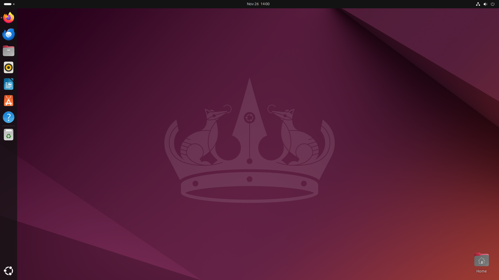
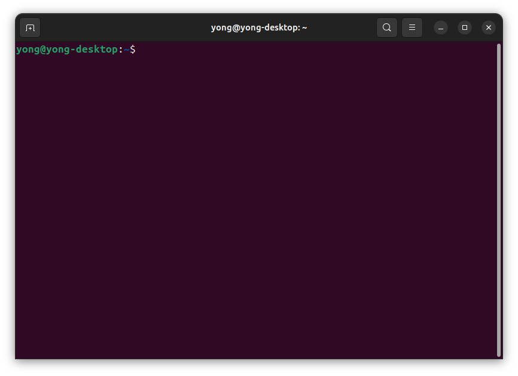
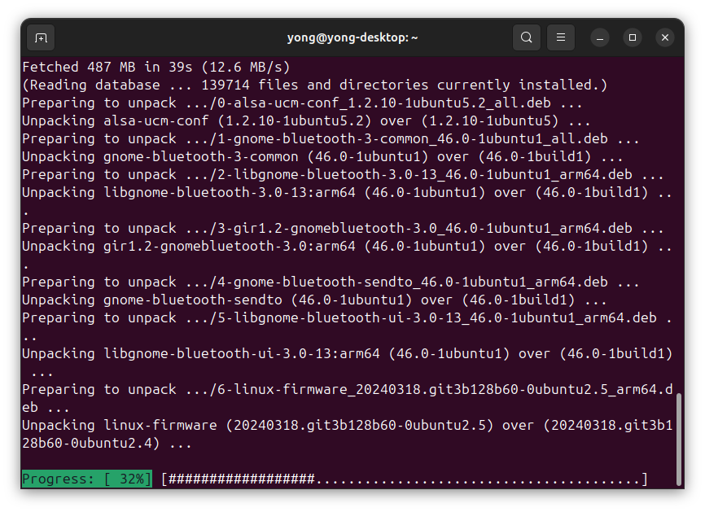
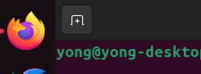
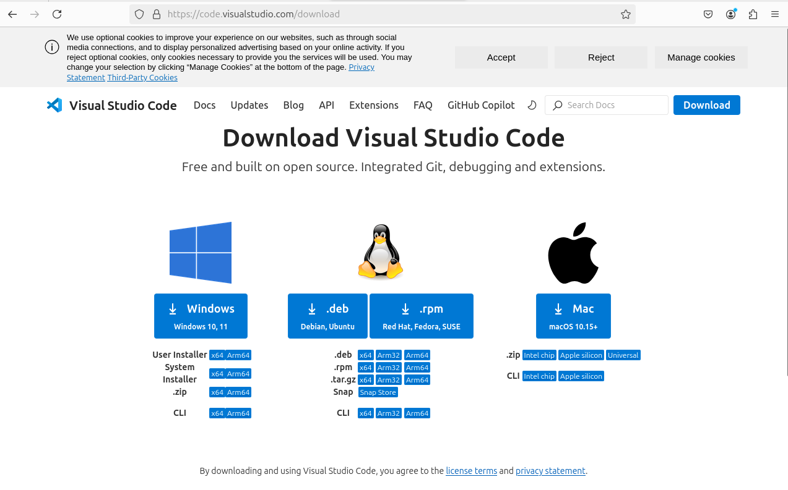
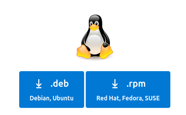
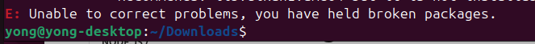
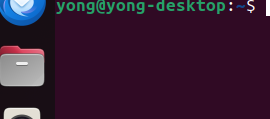
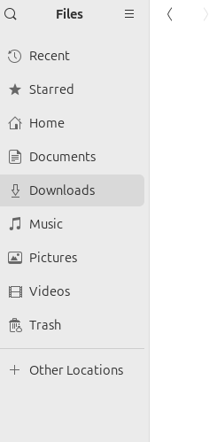

# Step-by-Step Tutorial for oppsett av Visual Studio Code på Ubuntu

<br>

## Steg 1⬇️

Dette er hvordan skjermen din kommer til å se ut når du har satt opp Ubuntuen din.

Du trykker deretter kommandoen:
```bash
Ctrl + Alt + T
```
Da får du opp et vindu som ser slik ut:


Her kan du kjøre kommandoene:
```bash
Sudo apt update
```
Skriv inn passordet du satt for maskinen din.


Når den er ferdig med å laste, kan du kjøre:
```bash
Sudo apt upgrade (Trykk "y + Enter" når den spør)
```

Det kommer å poppe opp masse tekst, noe som ser slik ut:

<br>
<br>

## Steg 2⬇️
Nå kan du trykke på FireFox browseren og søke opp "Visual Studio Code download"



<br>
Trykk på den øverste linken som kommer opp, da skal et vindu som dette komme opp på skjermen:


<br>

Trykk på ".deb" knappen under pingvinen for å laste ned VsCode filen for Ubuntu:



<br>

## Steg 3⬇️
Nå som du har lastet ned VsCode filen, må vi få til å laste ned VsCode i terminalen med hjelp av denne filen.

Gå tilbake til Terminalen og skriv inn kommandoen:
```bash
cd Downloads/
```

Og deretter, skriv inn kommandoen:
```bash
Sudo apt install ./c
```
Så kan du trykke på "Tab" så fyller den ut filnavnet av seg selv.
Kjør kommandoen og så skal du få opp noe som dette ettervært:
-1.jpg>)

<br>
Hvis du får opp en error som ser slik ut, kan du gå til steget "!!!"



Hvis det ikke kom opp noen errors, kan du skrive inn kommandoen:

```bash
code .
```

Hvis VsCode åpnes, har du fått det til!!

## !!!
I denne tutorialen når vi begynner å laste ned filen, er det mulig at denne filen vi lastet ned ikke funker (skjer hos noen), hvis filen ikke funker kan du trykke inn på "filer appen":



Trykk deretter inn på "Downloads" på siden av skjermen, og så kan du slette filen du nettopp lastet ned>




<br>
Når det er gjort, kan vi gå tilbake til VsCode download siden, og laste ned ".deb-arm64" istedet:

-1.png>)

Nå kan du gå tilbake til Steg 3 og prøve på nytt!